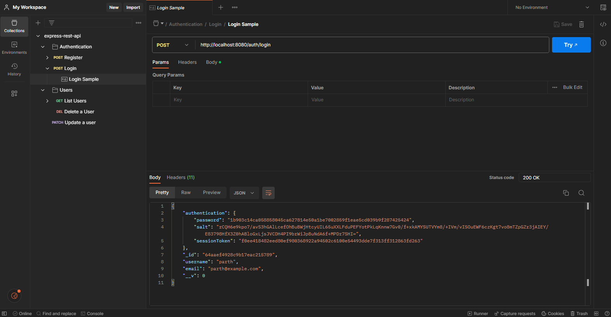

# Express REST API Backend
A simple implementation of CRUD operations with authentication support built using following techonologies
- Node.js
- TypeScript
- Express.js
- MongoDB

## How to setup the DB
- Create a MongoDB Atlas cluster
- Copy the Admin user ID and Password
- Select the mongoDB cluster URL and replace the ID and Password
- Set the mongoDB URL in `.env` file

## Sample Screenshot
</img>
